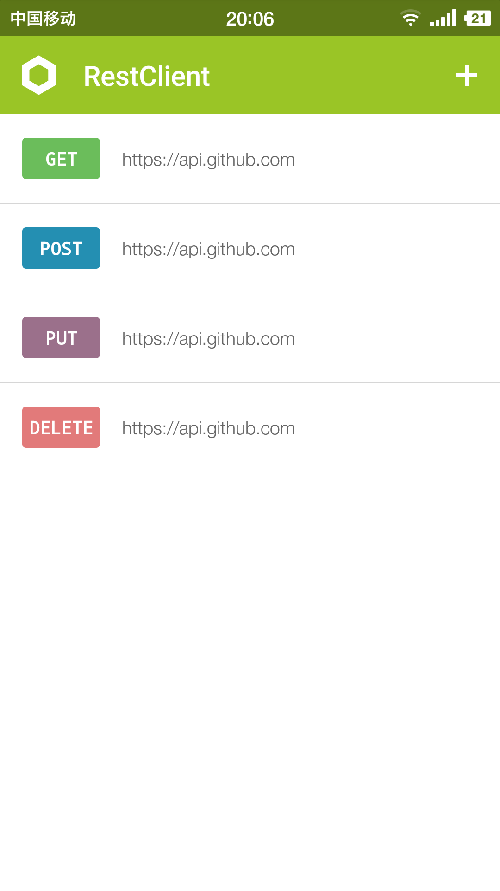
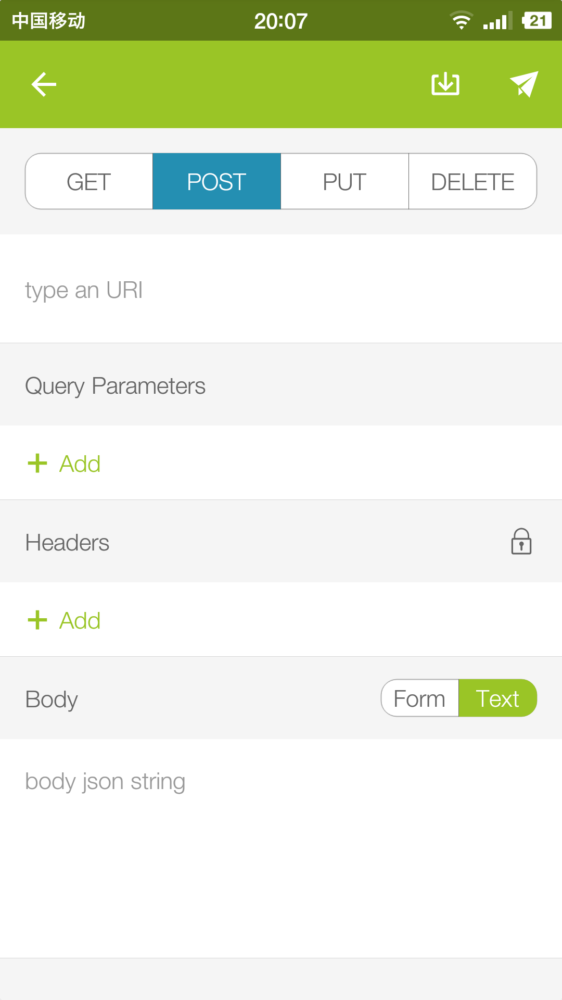
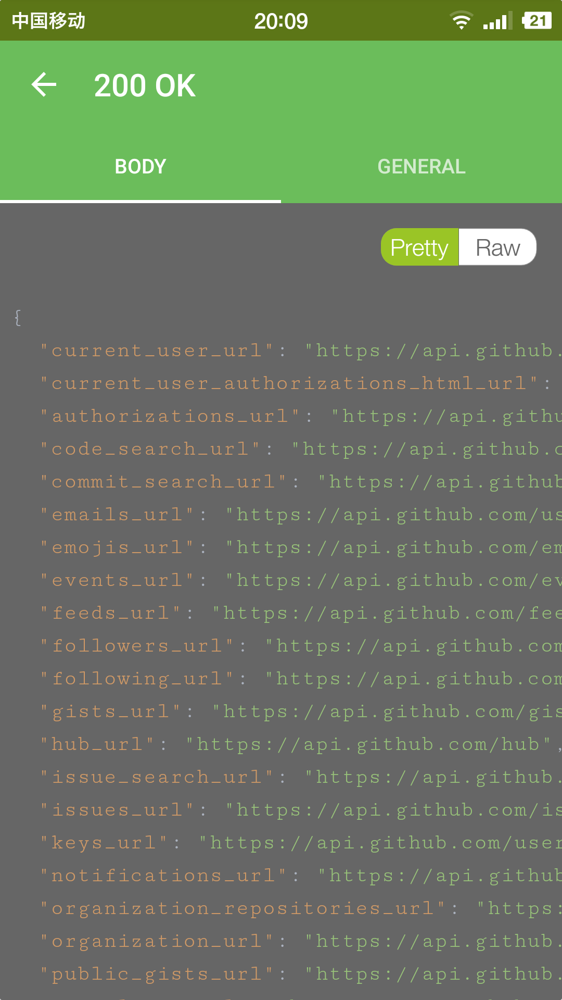

# RestClient

Make REST API(http or https) testing easy on mobile

1. Create rest apis: http or https
2. Support Request Method: Get, POST, PUT, DELETE
3. Simulate the request 
4. View the pretty response, elapse times

# Download
Version：0.9.0

[Download APK](http://deepoove.com/RestClient/)

# ScreenShot

